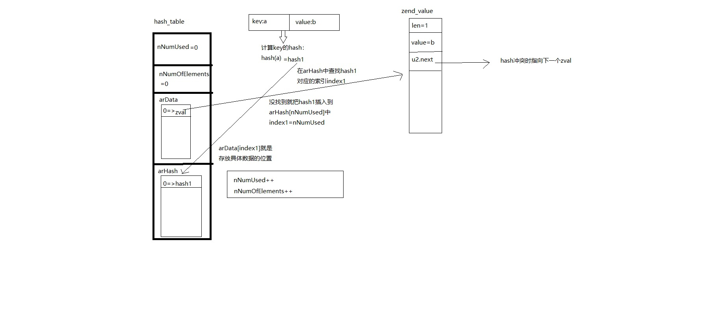

# php

## 几个全局变量

EG:：\_zend_executor_globals，Zend执行器相关的全局变量。

> Zend引擎在执行Opcode的时候，需要记录一些执行过程中的状态。
>
> 如，当前执行的类作用域，当前已经加载了那些文件等。

CG：\_zend_compiler_globals，Zend编译器相关的全局变量。

> 在PHP转换为Opcode过程中需要保存一些信息。这些信息就保存在CG全局变量中。

**EG和CG有一些数据是共用的。如，function_table (存储方法信息) ， class_table (存储类信息) 。**

PG：PHP全局变量。

> 我们知道php.ini会映射一个或者多个PHP全局结构。
> 
> 举几个使用这个宏的例子：PG(register_globals), PG(safe_mode), PG(memory_limit)

FG：文件全局变量。

> 大多数文件I/O或相关的全局变量的数据流都塞进标准扩展出口结构。

## 执行过程

1. php_module_startup

    注册常量，注册ini配置，注册全局变量（\_GET,\_POST），注册核心扩展，注册其他扩展，调用扩展的PHP_MINT()

2. php_request_startup

    初始化编译器，初始化执行器，初始化全局符号表，初始化词法分析器，调用扩展的PHP_RINT()

3. php_excute_script

    编译opcodes，执行opcode

4. php_request_shutdown

    调用使用register_shutdown_function()注册的方法

    调用对象的析构方法

    刷新输出

    调用扩展的RSHUTDOWN()方法

    销毁全局变量

    关闭编译器，执行器

5. php_module_shutdown

    调用扩展的MSHUTDOWN()方法

## 词法分析

源代码只是一段字符串。我们需要通过正则在字符串里找到所有的变量，赋值语句，函数等等标识（token）。这个过程称为词法分析

NFA-不确定有穷自动机

DFA-确定有穷自动机

re2c 词法分析工具

## 语法分析

将所有token建立一定的关系。

bison工具

##  **hashtable**

```c
struct _zval_struct {
    zend_value value;
    union {
        struct {
            ZEND_ENDIAN_LOHI_4(
                zend_uchar type,
                zend_uchar type_flags,
                zend_uchar const_flags,
                zend_uchar reserved
            )
        } v;
        uint32_t type_info;
    } u1;
    union {
        uint32_t var_flags;
        uint32_t next;       /* hash collision chain */
        uint32_t cache_slot; /* literal cache slot */
        uint32_t lineno;     /* line number (for ast nodes) */
    } u2;
};
typedef struct _Bucket {
    zend_ulong        h;
    zend_string      *key;
    zval              val;
} Bucket;
typedef struct _HashTable {
	uint32_t          nTableSize;
	uint32_t          nTableMask;
	uint32_t          nNumUsed;/* hash table中已用的长度 */
	uint32_t          nNumOfElements;/* hash table中已有元素数量 */
	zend_long         nNextFreeElement;
	Bucket           *arData;
	uint32_t         *arHash;
	dtor_func_t       pDestructor;
	uint32_t          nInternalPointer;
	union {
		struct {
			ZEND_ENDIAN_LOHI_3(
				zend_uchar    flags,
				zend_uchar    nApplyCount,
				uint16_t      reserve)
		} v;
		uint32_t flags;
	} u;
};
```

插入时，计算hash值(hash)，存入arHash中：

查找key在arHash中的index。

如果存在index，新数据（zval结构）会链到`arData[index].zval.u2.next`下（zval.u2.next实现了hashtable的链表功能），

如果不存在，将hash存入`arHash[nNumUsed]`中，并将新数据放入`arData[nNumUsed]`中。

查找时和插入差不多，先查找这个key在arHash的index。存在就去`arData[index]`找_Bucket的key，相同就是当前元素，不相同就查找zval链表（zval.u2.next）



## opcode

vld : opcode 查看器


## 内存管理

zend内存块

huge(chunk)：2M

large(page)：4K

small(slot)：3K

