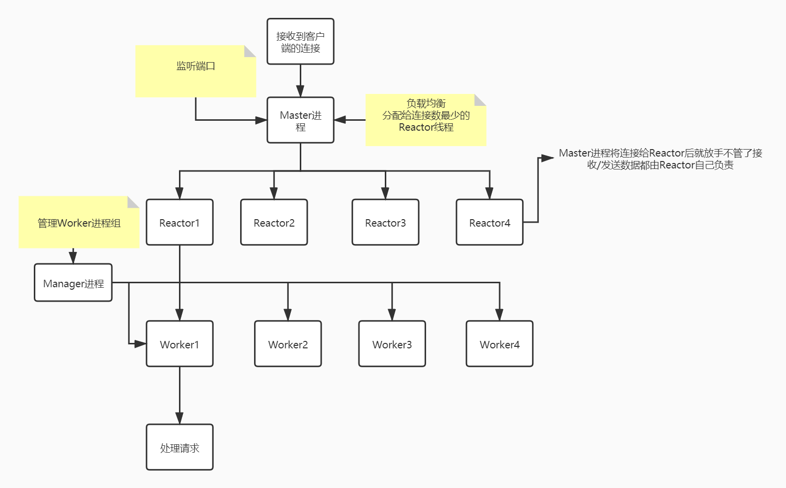

# swoole

## swoole与fpm的爱恨情仇:cupid:

+ swoole = nginx + fpm

> nginx监听服务端口，fpm的master进程管理worker进程，worker进程处理php请求
> 
> swoole的master进程监听服务端口，master进程里的Reactor线程处理连接（如拆包组包等），Manager进程管理worker进程，worker进程处理php请求

+ 常驻内存

> 随着框架的发展框架的体系越来越多，框架启动需要加载很多东西，包括php本身运行需要编译成opcode，非常影响性能。而swoole可以让php常驻内存。大大提升了php和其框架的性能。

+ 延展了php的应用场景

> swoole是网络框架，除了http，还支持tcp，websocket等网络协议。

+ 异步非阻塞

> pm启动时创建一个master进程和n个worker进程。如果请求过多，fpm会创建更多的worker进程。处理完请求再销毁。频繁大量的创建销毁进程非常耗cpu性能。
> 
> 而swoole的worker进程是异步非阻塞的。少量进程就可以处理大量请求。大大提升性能。
> 
> swoole还支持协程。

## swoole长链接原理

tcp协议的keepalive机制

```c
//开启keepAlive后，检测到连接keepIdle秒没有通讯过，就启动发包探测。探测失败后，在keepInterval秒后重新发起探测，探测重试次数为keepCount。

int keepAlive;//开启keepalive
int keepIdle;//开启探测时长
int keepInterval;//发包间隔
int keepCount;//发包重试次数
```

swoole的保活

```php
$serv->set(array(
	'heartbeat_check_interval' => 5,//探测间隔
	'heartbeat_idle_time' => 10,//未响应探测，切断连接的时长。最好是heartbeat_check_interval的2倍多，防止一次探测丢包就被切断了连接。
));
```

TCP中已有SO_KEEPALIVE选项，为什么还要在应用层加入心跳包机制:question:

> 因为TCP协议中的SO_KEEPALIVE有几个致命的缺陷：
>
> keepalive只能检测连接是否存活，不能检测连接是否可用。比如服务器因为负载过高导致无法响应请求但是连接仍然存在，此时keepalive无法判断连接是否可用。
> 如果TCP连接中的另一方因为停电突然断网，我们并不知道连接断开，此时发送数据失败会进行重传，由于重传包的优先级要高于keepalive的数据包，因此keepalive的数据包无法发送出去。只有在长时间的重传失败之后我们才能判断此连接断开了。

# swoole进程模型



