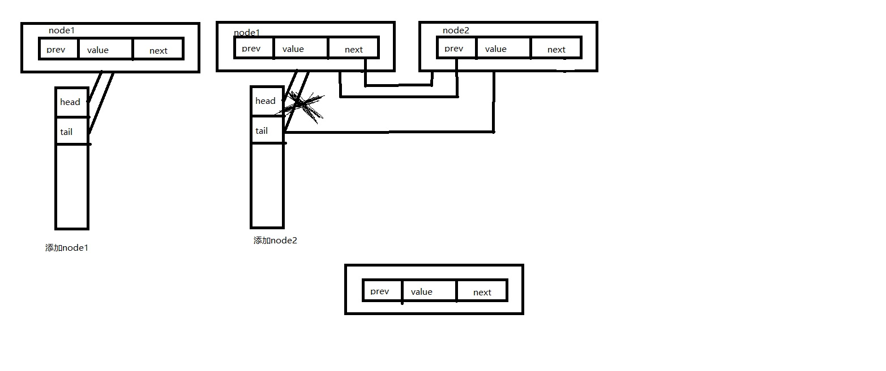

# redis

`OBJECT ENCODING key` key的数据类型

## 锁

setnx key value

当key不存在时，返回成功，否则失败


## 数据结构

### sds

字符串

```c
struct __attribute__ ((__packed__)) sdshdr {
    uint8_t len; /* 字符串长度 */
    uint8_t alloc; /* buf的大小 */
    unsigned char flags; /* 低3位表示类型 */
    char buf[]; /* 存放具体内容 */
};
```

`__attribute__ ((__packed__))`作用是防止gcc编译器对代码进行*内存对齐*优化

### dict

```c
/* 哈希表实体-存放内容 */
typedef struct dictEntry {
    void *key;/* key */
    union {
        void *val;
        uint64_t u64;
        int64_t s64;
        double d;
    } v;/* value */
    struct dictEntry *next;/* hash相同时，通过链表链到下一个数据节点 */
} dictEntry;

typedef struct dictType {
    uint64_t (*hashFunction)(const void *key);
    void *(*keyDup)(void *privdata, const void *key);
    void *(*valDup)(void *privdata, const void *obj);
    int (*keyCompare)(void *privdata, const void *key1, const void *key2);
    void (*keyDestructor)(void *privdata, void *key);
    void (*valDestructor)(void *privdata, void *obj);
} dictType;

/* 哈希表 */
typedef struct dictht {
    dictEntry **table;/* 数据数组 */
    unsigned long size;/* 大小 */
    unsigned long sizemask;/* 哈希表大小掩码，用于计算索引值，总是等于 size-1 */
    unsigned long used;/* 节点数 */
} dictht;

typedef struct dict {
    dictType *type; /* 字典类型 */
    void *privdata;
    dictht ht[2]; /* 2张hash tablse，rehash的时候相互交换 */
    long rehashidx; /* rehashing not in progress if rehashidx == -1 */
    unsigned long iterators; /* number of iterators currently running */
} dict;
```


## redis对象

### hash

类似于map<key,map<key,value>>

缺点：过期功能只能作用在key上，而不是field上

### list

有序列表



BRPOP：从list尾部弹出一个元素，如果list里没有元素会阻塞

可以使用LPUS + BRPOP来实现阻塞队列

### set

集合

`SADD key` 添加元素

`SMEMBERS key` 获取所有元素

`SCARD key` 获取所有元素的总数

`SISMEMBER key` 判断元素是否存在

`SRANDMEMBER key [count]` 随机获取count个元素

`SPOP key [count]`，随机弹出（会删除集合中的元素）count个元素

*支持集合操作*

（如相互关注，可能关注的人）

SINTER：交集

SUNION：并集

SDIFF：差集

### zset

有序集合

## 分布式锁 redission

根据setnx 来实现，加超时时间，加线程循环给key续时间，使用lua来实现redis原子操作